# Political Sphere CI/CD Platform - Visual Workflow Architecture

## Overview Architecture

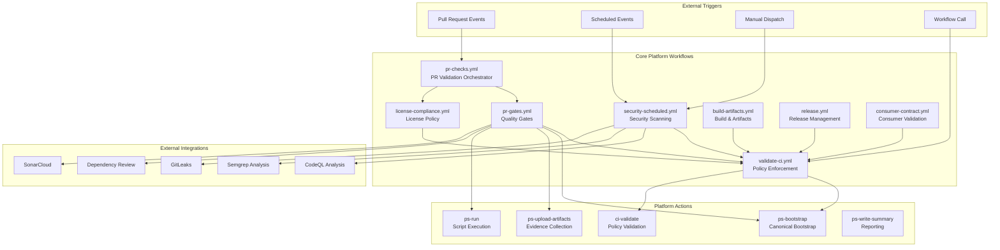

## Validate-CI Workflow Diagram

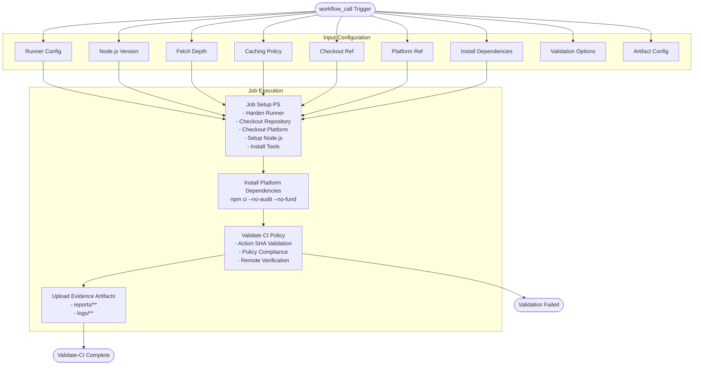

## PR Gates Workflow Diagram

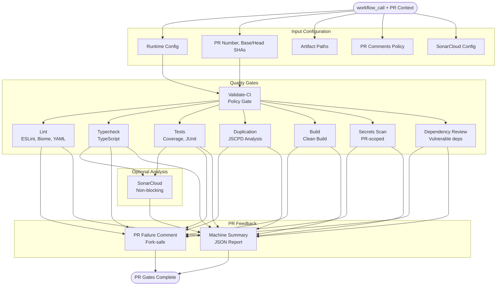

## Security Scheduled Workflow Diagram

```mermaid
graph TD
    START([schedule | workflow_dispatch | workflow_call])
    
    subgraph "Input Configuration"
        RUNNER[Runner Config]
        LANGUAGES[CodeQL Languages]
        CACHE[Caching Policy]
    end

    subgraph "Security Scans"
        VALIDATE[Validate-CI<br/>Policy Gate]
        
        subgraph "Full History Scans"
            SECRETS[Secrets Scan<br/>Gitleaks Full History]
        end
        
        subgraph "Static Analysis"
            CODEQL[CodeQL Analysis<br/>SARIF Output]
            SEMGREP[Semgrep CE<br/>SARIF Output]
        end
        
        subgraph "Reporting"
            SUMMARY[Security Summary<br/>Machine Readable]
            SARIF_UPLOAD[SARIF Upload<br/>GitHub Security]
        end
    end

    START --> RUNNER
    START --> LANGUAGES
    START --> CACHE

    RUNNER --> VALIDATE
    LANGUAGES --> CODEQL
    CACHE --> SECRETS

    VALIDATE --> SECRETS
    VALIDATE --> CODEQL
    VALIDATE --> SEMGREP

    SECRETS --> SARIF_UPLOAD
    CODEQL --> SARIF_UPLOAD
    SEMGREP --> SARIF_UPLOAD

    SECRETS --> SUMMARY
    CODEQL --> SUMMARY
    SEMGREP --> SUMMARY

    SUMMARY --> COMPLETE([Security Analysis Complete])
```

## Release Workflow Diagram

```mermaid
graph TD
    START([workflow_call])
    
    subgraph "Release Configuration"
        VERSION[Release Version<br/>SemVer Required]
        REF[Release Ref<br/>Branch or SHA]
        NOTES[Generate Notes<br/>Auto-generation]
        RUNTIME[Runtime Config]
    end

    subgraph "Release Process"
        VALIDATE[Validate-CI<br/>Policy Gate]
        
        subgraph "Release Publishing"
            TAG[Create Git Tag<br/>v{version}]
            RELEASE[Publish GitHub Release<br/>Notes + Artifacts]
        end
        
        subgraph "Evidence & Reporting"
            ARTIFACTS[Upload Release Evidence<br/>Reports + Logs]
            SUMMARY[Release Summary<br/>Machine Readable]
        end
    end

    START --> VERSION
    START --> REF
    START --> NOTES
    START --> RUNTIME

    VERSION --> VALIDATE
    REF --> VALIDATE
    NOTES --> RELEASE
    RUNTIME --> VALIDATE

    VALIDATE --> TAG
    TAG --> RELEASE
    RELEASE --> ARTIFACTS
    ARTIFACTS --> SUMMARY

    SUMMARY --> COMPLETE([Release Complete])
```

## Build Artifacts Workflow Diagram

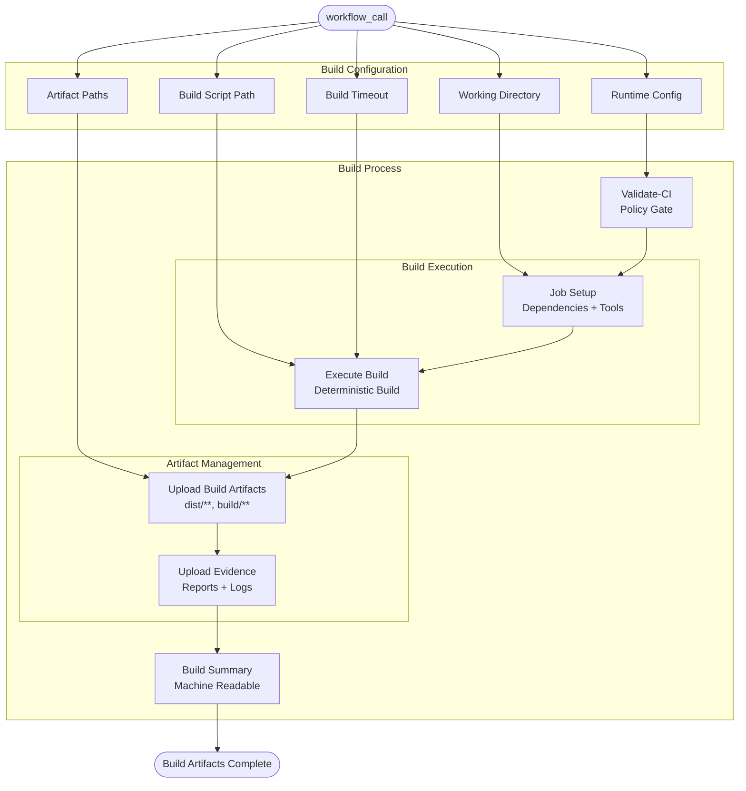

## Consumer Contract Workflow Diagram

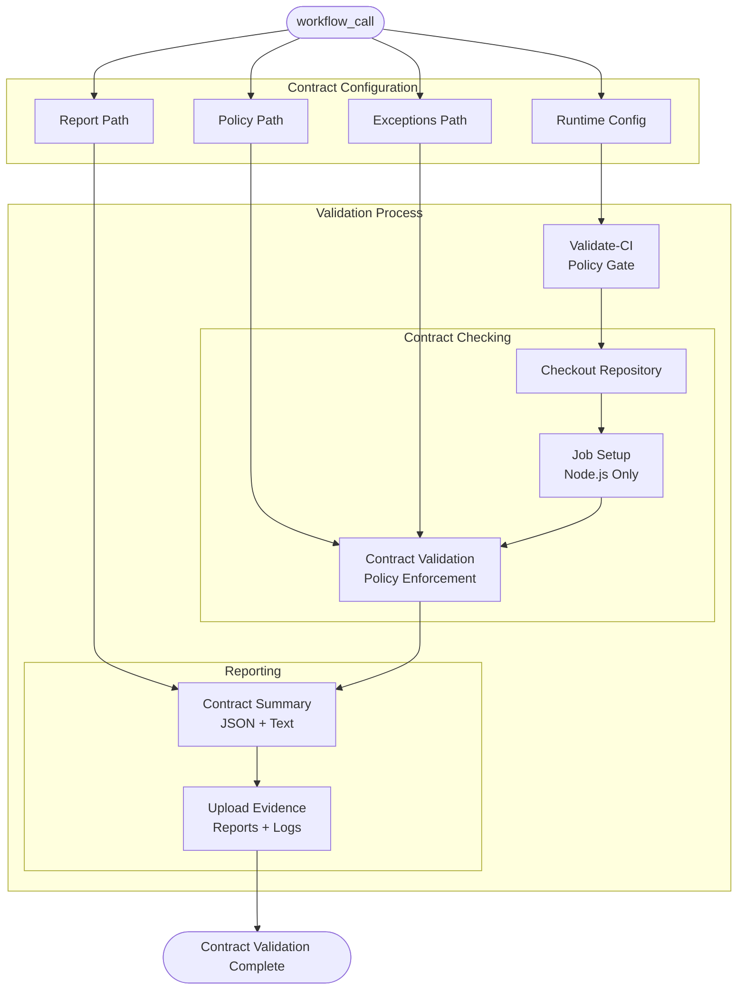

## License Compliance Workflow Diagram

```mermaid
graph TD
    START([workflow_call | pull_request])
    
    subgraph "License Configuration"
        RUNTIME[Runtime Config]
        LICENSE_POLICY[License Policy Path]
        LOCK_FILE[Lockfile Path]
        REPORT_DIR[Report Directory]
    end

    subgraph "Compliance Process"
        VALIDATE[Validate-CI<br/>Policy Gate]
        
        subgraph "License Analysis"
            SETUP[Job Setup<br/>Dependencies]
            LICENSE[License Compliance<br/>Policy Enforcement]
        end
        
        subgraph "Evidence Collection"
            UPLOAD[Upload License Reports<br/>Policy Violations]
            SUMMARY[Compliance Summary<br/>Machine Readable]
        end
    end

    START --> RUNTIME
    START --> LICENSE_POLICY
    START --> LOCK_FILE
    START --> REPORT_DIR

    RUNTIME --> VALIDATE
    LICENSE_POLICY --> LICENSE
    LOCK_FILE --> LICENSE
    REPORT_DIR --> UPLOAD

    VALIDATE --> SETUP
    SETUP --> LICENSE
    LICENSE --> UPLOAD
    UPLOAD --> SUMMARY

    SUMMARY --> COMPLETE([License Compliance Complete])
```

## Workflow Dependency Matrix

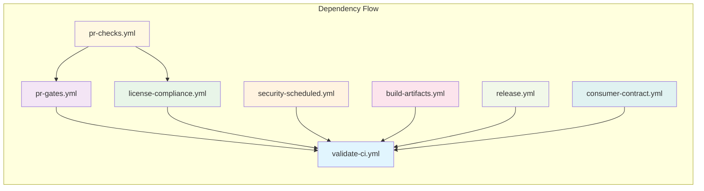

## Execution Flow Timeline

```mermaid
gantt
    title Political Sphere Workflow Execution Timeline
    dateFormat X
    axisFormat %Ss

    section PR Validation
    Validate-CI           :active, v1, 0, 30s
    Lint                  :v2, after v1, 45s
    Typecheck            :v3, after v1, 30s
    Tests                :v4, after v1, 60s
    JSCPD                :v5, after v1, 40s
    Build                :v6, after v1, 50s
    Secrets Scan         :v7, after v1, 25s
    Dependency Review    :v8, after v1, 20s
    License Compliance   :v9, after v1, 35s

    section Release
    Validate-CI           :active, r1, 0, 30s
    Tag Creation          :r2, after r1, 10s
    Release Publishing    :r3, after r2, 20s
    Evidence Upload       :r4, after r3, 15s

    section Security Scan
    Validate-CI           :active, s1, 0, 30s
    Secrets Full Scan     :s2, after s1, 120s
    CodeQL Analysis       :s3, after s1, 180s
    Semgrep Analysis      :s4, after s1, 90s
    SARIF Upload          :s5, after s4, 10s
```

## Key Architectural Patterns

### 1. **Canonical Bootstrap Pattern**
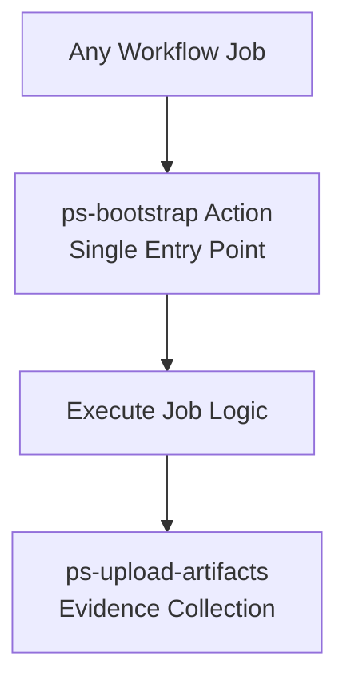

### 2. **Policy Gate Pattern**
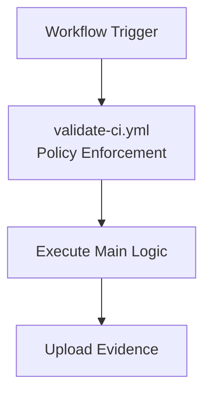

### 3. **Evidence-First Pattern**
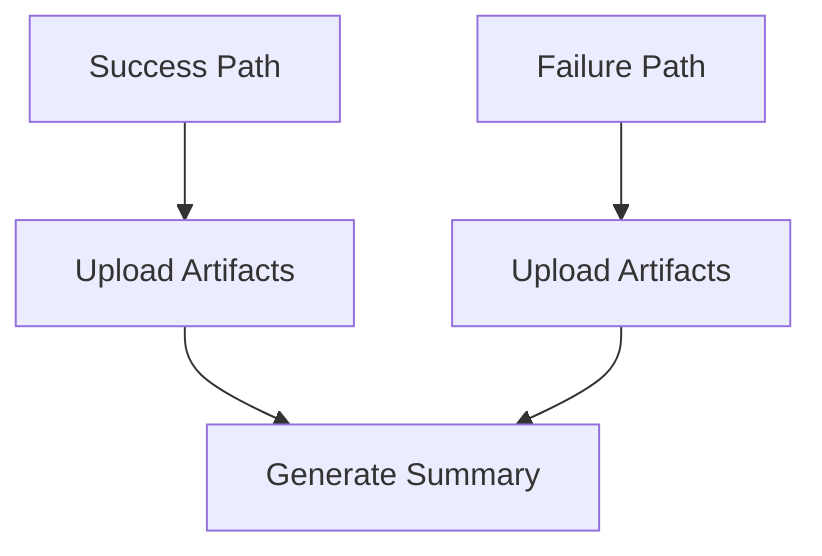

## Security Architecture

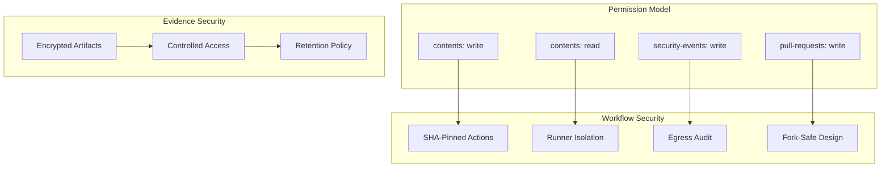

This visual documentation provides a comprehensive understanding of the Political Sphere CI/CD platform architecture, workflow dependencies, execution patterns, and security model. The diagrams illustrate the sophisticated design patterns and best practices implemented throughout the platform.